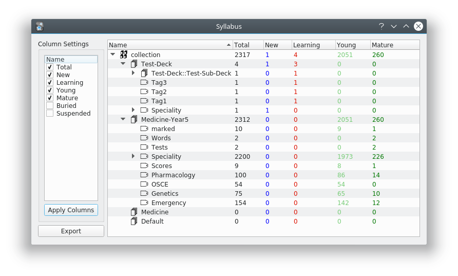
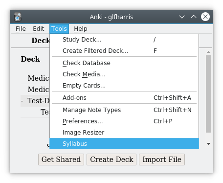

# Syllabus

An [Anki](https://apps.ankiweb.net/) addon designed to show deck statistics broken down at the deck and tag level.

#### Usage

Open Syllabus through Tools > Syllabus

This then runs syllabus with the default column selection (Total, New, Learning, Young, and Mature). If you have a very large collection this may take some time, however it's normally just a couple of seconds.

If you wish to change the column selection, simply check or uncheck in the column settings list, then click `Apply Columns`. This then regenerates the tree with the new selection. Note that becuase Syllabus doesn't calculate the stats on unselected columns to save time, adding more columns may take Syllabus longer to generate.

Clicking the `Export` button opens a file dialog allowing you to export the tree to a csv file. Exporting the tree will export the data currently viewable in the tree, any unchecked columns will not be exported.

#### Install

[Add-on page](https://ankiweb.net/shared/info/668156440) or just use code `668156440`

#### Change Log
* 2018-09-20 - v0.1.0 - Initial Release

#### To Do

* On double click open browser on tag/deck
* Fix sorting to make logical sense - No idea what's happening now
* Add lapses and reviews in a way that is useful
* Investigate Stats window opening on Tag

***

Please feel free to add any suggestions or thoughts. This is one of my first projects using Qt, so any critique would be very useful.
